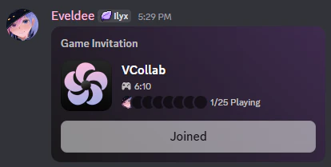

# VCollab Beta Documentation

Welcome to the documentation and user guide for the VCollab beta test. If you are here, it means that you're interested in trying out VCollab, so don't forget to join the [official Discord server](https://vcollab.net/discord) to give your feedback and opinion about the software.

The main objective of the beta testing of VCollab is to make the software better and ready for a public release. In the meantime, this version contains the minimum necessary to organize collaborations using VCollab and share models. More instructions on how to achieve this below.

> [!WARNING]
>
> As all collaboration softwares do, VCollab comes with its own privacy and security concerns, although it is written to be as safe as possible. Please read the [Privacy/Security concerns](#privacysecurity-concerns) section before using VCollab and be careful when sharing collaboration codes/invites. The software comes with no guarantee and the authors cannot be held responsible for any wrong or malicious usage of VCollab.

## Table of Content

- [Table of Content](#table-of-content)
- [Installation](#installation)
- [Usage Guide](#usage-guide)
  - [Requirements](#requirements)
  - [Initial setup](#initial-setup)
  - [Hosting a collaboration](#hosting-a-collaboration)
  - [Joining a collaboration](#joining-a-collaboration)
  - [Using discord invitations](#using-discord-invitations)
- [Privacy/Security concerns](#privacysecurity-concerns)
- [Planned features](#planned-features)
- [Make a bug report](#make-a-bug-report)

## Installation

VCollab comes fully packed with all required dependencies, this means that the installation is as simple as downloading the software and starting the `VCollab.exe` executable:
- Download the latest version from the [Releases page](https://github.com/VCollab-Net/VCollab/releases). As of now, this is the only place to download official versions of VCollab, other sites and store will be available at a later date.

- Extract the `VCollab.zip` archive
- Start VCollab by opening `VCollab.exe`

> [!NOTE]
>
> VCollab is a new software and as such there is a high chance that you get the Windows SmartScreen dialog when trying to open VCollab for the first time. Make sure to click on "More info" then on "Run anyway" to start VCollab.  
> Unfortunately, Microsoft ask developers to pay a really high price to get trusted certificates from them to disable this screen. VCollab being free, I am in no mean able to get a certificate from them.

## Usage Guide

### Requirements

Here are the general requirements to run VCollab and use it in good conditions:
- Windows 10, 11 or newer
- A vtubing model software supporting Spout2 (VTube Studio, VSeeFace, VNyan, Warudo, ...)
- Fast internet connection (both in download and upload). A small model (400x500 pixels) uses around 6000 kbit/s of upload.
- [OBS Spout2 Plugin](https://github.com/Off-World-Live/obs-spout2-plugin) if you use OBS to stream and the plugin is not already installed

> [!TIP]
>
> Most vtubing softwares like VTube Studio support Spout2 but it is not enabled by default. Usually, enabling this is as simple as checking a box in the software settings, here are instructions on how to enable it for some softwares:
> - [VTube Studio](https://github.com/DenchiSoft/VTubeStudio/wiki/Recording-Streaming-with-OBS#using-spout2-for-streaming-to-obs-with-invisible-ui-transparent-background)
> - [VSeeFace](https://www.vseeface.icu/spout)
> - [VNyan](https://youtu.be/K7C6tQ6DE3k?si=5BH1Rra455sa0uuE&t=98)
> - [Warudo](https://docs.warudo.app/docs/assets/camera#output)

### Initial setup

Thee first time you start VCollab, you will be asked to enter a name, this name is not used yet and is not displayed anywhere but it will used in future updates. Don't put any personal information there.

After clicking on "_Confirm_", you will be redirected to the source setup screen. This screen allows you to select from which vtubing software to grab your model from. If you do not see your vtubing software (like VTube Studio for example), make sure you enabled Spout2 in the software settings (_c.f. [requirements](#requirements)_).

After selecting your vtubing software, you need to position the purple rectangle properly so it covers your model. You can move the rectangle by draging it and resize it by using the pink "handles".  
Ideally, you want this rectangle to be as small as possible because this is the region that will be sent over the network to other participants, the smaller it is, the less internet bandwidth will be used.

Once ready, press on _Confirm_, this will lead you to the main VCollab screen.

Illustrated below is the main VCollab screen, this is where everything related to collaborations will happen.

On the main screen, you can move any model (yours or those from other participants) by dragging them using left click. Resizing models is done by using the scroll wheel when hovering over a model. The controls are similar to what you may be already used to on VTube Studio.

There are three buttons on the left side of the screen, from top to bottom they are used to
- Purple: open the source setup screen (the same that was shown when you first started VCollab)
- Blue: send VCollab logs to the developers (use this when making a bug report to help the developers identify the issue)
- Red: quit VCollab (close the app)

On the top-left corner of the screen are the network metrics. Those are used to know your network usage and contain other debug informations.

The bottom-left corner of the screen is used to organize collabs, more on that below.

> [!TIP]
>
> Make sure that you can see your model on this screen and that transparency works properly. If you do not see your model, other participants will not be able to see it too, so make sure it works properly before trying to make collaborations.

### Hosting a collaboration

To host a collaboration, you have to click on the _"Host"_ in the bottom-left corner of the screen, this will copy an invite code to your clipboard (e.g. `vcollab-IPDcVaK1Dj`). You can share this code to the other participants to allow them to join your collaboration.

> [!IMPORTANT]
>
> Never share your collaboration code to person you do not trust, anyone with the code can join a collaboration, **it is effectively the password** for the collaboration. Because of this, always share codes using private channels and never show them on screen during streams.

> [!NOTE]
>
> When a collaboration has more than two participants, the **Host** has increased upload speed usage and other participants only have increased download speed usage. Generally, ISP tend to limit upload speed so make sure the person hosting is the one with the highest upload speed.

### Joining a collaboration

To join a collaboration, simply copy the collaboration code you received from the **Host** to your clipboard (select the ext, right click -> copy to clipboard) and click on the _"Join"_ button. This will automatically connect you to the host and the other participants.

### Using discord invitations

Another way to invite people to collaborations is by using discord invites. Follow the instructions below too use them:
- Host a collaboration by clicking on the _"Host"_ button
- Send an invite in a private/restricted channel by clicking on the "+" sign in near the message box in discord and click on "Invite <channel/members> to Play VCollab"
- This will send an invite message that will allow people that can see this message to join the collaboration

> Button to send a collaboration invite through Discord

> A discord invitation message, anyone that has access to this message can click on "Join" to join a collaboration at any moment

> [!IMPORTANT]
>
> Same as for the collaboration codes, never share your collaboration invite to person you do not trust, anyone with this invite can join a collaboration, **it is effectively the password** for the collaboration. Because of this, always share discord collaboration invites in private channels where only the participants have access to. Showing the invite message on screen during a stream is not an issue, Discord hide invite secrets and they are securely sent to the other participants.

## Privacy/Security concerns

As all softwares that interact with other computers, there are some risks to consider before using VCollab.

Firstly, compared to VTube Studio and other softwares, VCollab **never send or fetch your model/assets files** so other participants cannot steal your model (yes, this is something that is possible with VTube Studio VNet or similar techs on VNyan, Warudo, etc). See [VNet Security](https://github.com/DenchiSoft/VTubeStudio/wiki/VNet-Security) page for more information about the risk of those collaboration methods. VCollab does not have this issue because it sends your model as an image over the network, no model files are used.

However, VCollab does not use a central server to send data over internet but instead use a P2P protocol. Without this, I would need to rent a really powerful server which would cost multiple hundreds/thousands of € per month, which is definitely not something possible for a free and open-source software. The good thing about using a P2P protocol is that latency in VCollab is minimal.  
Using a P2P protocol means that you are directly connecting to the **Host** of the collaboration _(and to all other participants if you are the host)_ which means that a malicious participant could inspect their network traffic and try to find to which IP address the packets are sent. This is why you should **NEVER** use VCollab with people you cannot trust, especially if they know how to inspect network traffic. Fortunately, in this day and age, "public" IPs are shared among thousands of homes and computers (all ISP use what we call [CGNAT](https://en.wikipedia.org/wiki/Carrier-grade_NAT) nowadays) which means the IP used generally only gives a really broad information about your location and cannot be used to make DDoS or similar attacks. But better be safe than sorry, I repeat, do not use VCollab with people you cannot trust.

> [!IMPORTANT]
>
> Of course, the security concerns only apply to people in the same collaboration, IP addresses are never shared or stored in any central server, they are just used ephemerally to create a connection between the participants.  
> Someone without the secret collaboration code cannot join a collaboration, and thus, cannot find any IP addresses. So as written in multiple places, **never share a collaboration code to people that are not participating in a collaboration**.

## Planned features

VCollab is still a software in early access beta version, here is a non-exhaustive list of planned features:
- Proper UI with more settings
- Collaboration management (see participants, reorder them, kick, ban, ...)
- Save and load participants position and size
- Possibility to hide own model from the output
- Change the transparency tolerance (the current algorithm does not work well with some specific models)
- Auto update check/updated
- Model downscaler (to send a smaller version of your model over the network without having to change in side in your vtubing model)
- More feedback in UI (notifications, alerts, ...)
- And many more, any suggestion is welcome

## Make a bug report

To report a bug, please send a message on the [official discord server](https://vcollab.net/discord) and click on the blue circle button in the main screen to send automatically send you log files too. Alternatively, you can find the logs files and their content in `%appdata%\VCollab\logs`

<!-- Fix style when printed to HTML -->
<link rel="stylesheet" href="/Resources/fix.css">